# /prospect Command Flow Architecture

## Complete System Flow

```mermaid
flowchart TD
    Start([User runs /prospect]) --> ParseInput{Parse Input Type}

    ParseInput -->|Name-based| DirectResearch[Direct Contact Research]
    ParseInput -->|Role-based --role| RoleSearch[Role-based Contact Discovery]

    RoleSearch --> ListContacts[List contacts with role via ZoomInfo]
    ListContacts --> UserSelect[User selects contact]
    UserSelect --> DirectResearch

    DirectResearch --> Step1[STEP 1: Run Research Script]

    %% Step 1: Research
    Step1 --> InitClients[Initialize API Clients]
    InitClients --> ZI[ZoomInfo Client + JWT]
    InitClients --> PP[Perplexity Client]
    InitClients --> Cache[Cache System]

    Cache --> CheckCache{Check Cache<br/>90-day TTL}
    CheckCache -->|Cache Hit| LoadCached[Load Cached Data]
    CheckCache -->|Cache Miss<br/>or --force-refresh| RunResearch[Run Fresh Research]

    LoadCached --> OrchestrateSources
    RunResearch --> OrchestrateSources[Research Orchestrator]

    OrchestrateSources --> ZISearch[ZoomInfo: Contact Profile]
    OrchestrateSources --> PPSearch[Perplexity: Company Intelligence]
    OrchestrateSources --> WFSearch[WebFetch: Company Website]

    ZISearch --> SynthesizeContext[Context Synthesizer]
    PPSearch --> SynthesizeContext
    WFSearch --> SynthesizeContext

    SynthesizeContext --> SaveRaw[Save /tmp/prospect_research_raw.json]
    SynthesizeContext --> SaveContext[Save /tmp/prospect_context.json]

    SaveRaw --> Step2[STEP 2: Run Hybrid Rules Engine]

    %% Step 2: Hybrid Rules Engine
    Step2 --> LoadRules[Load YAML Rules Config]
    LoadRules --> DetectPersona[Detect Persona from Job Title]

    DetectPersona --> ExtractSignals[Extract Verified Signals]
    ExtractSignals --> CheckTier{Check Tier Requirements}

    CheckTier -->|Tier A: 3+ signals| BuildBrief
    CheckTier -->|Tier B: 2+ signals| BuildBrief
    CheckTier -->|Insufficient signals| InsufficientSignals[Write prospect_status.json]

    InsufficientSignals --> FallbackDecision{User Decision}
    FallbackDecision -->|Try Tier B| Step2B[Rerun with Tier B]
    FallbackDecision -->|Manual research| GatherMore[Gather more signals]
    FallbackDecision -->|--fallback flag| DirectDraft[Direct Drafting Mode]

    Step2B --> LoadRules
    GatherMore --> Step2

    BuildBrief[Build Prospect Brief] --> GenAngles[Generate Candidate Angles]
    GenAngles --> FilterAngles[Filter by Persona + Industry]
    FilterAngles --> SelectOffer[Select Offer/CTA]
    SelectOffer --> BuildDraft[Build Draft Sentences]

    BuildDraft --> SaveEmailContext[Save /tmp/email_context.json]
    SaveEmailContext --> Step3[STEP 3: Load Email Context]

    %% Step 3: Check Status
    Step3 --> CheckStatus{Check Status Field}
    CheckStatus -->|ready_for_rendering| Step4
    CheckStatus -->|insufficient_signals| FallbackDecision

    %% Step 4: Angle Scoring (if needed)
    Step4[STEP 4: Score Angles] --> AngleCheck{Multiple<br/>Candidate Angles?}
    AngleCheck -->|Yes| ScoreAngles[Claude Code Scores Angles]
    AngleCheck -->|No| Step5

    ScoreAngles --> BuildPrompt[Build Scoring Prompt]
    BuildPrompt --> ClaudeScore[LLM Scoring<br/>Temperature: 0.0]
    ClaudeScore --> CalcWeighted[Calculate Weighted Scores]
    CalcWeighted --> SelectBest[Select Highest Scoring Angle]
    SelectBest --> Step5

    %% Step 5: Render Email
    Step5[STEP 5: Render Email Variants] --> LoadDraft[Load Draft Sentences]
    LoadDraft --> LoadSignals[Load Verified Signals]
    LoadSignals --> BuildRenderPrompt[Build Rendering Prompt]

    BuildRenderPrompt --> ClaudeRender[Claude Code Renders Variants<br/>Temperature: 0.7]
    ClaudeRender --> Generate2to3[Generate 2-3 Variants]
    Generate2to3 --> Step6

    %% Step 6: Validation
    Step6[STEP 6: Validate Variants] --> ValidateEach{For Each Variant}
    ValidateEach --> CheckSignals[Check Signal Integrity]
    CheckSignals --> CheckStructure[Check Structure]
    CheckStructure --> CheckQuality[Check Quality Rules]

    CheckQuality --> ValidationPass{Pass?}
    ValidationPass -->|Yes| AddToValid[Add to Valid List]
    ValidationPass -->|No| RepairAttempts{Repair Attempts<br/>< 2?}

    RepairAttempts -->|Yes| RepairVariant[Repair Variant<br/>Temperature: 0.3]
    RepairAttempts -->|No| DiscardVariant[Discard Variant]

    RepairVariant --> ValidationPass
    AddToValid --> MoreVariants{More Variants?}
    DiscardVariant --> MoreVariants

    MoreVariants -->|Yes| ValidateEach
    MoreVariants -->|No| CheckValidCount{Valid Variants > 0?}

    CheckValidCount -->|Yes| Step7
    CheckValidCount -->|No| FallbackRender[Fallback: Use Draft Sentences Directly]

    FallbackRender --> Step8

    %% Step 7: Select Best
    Step7[STEP 7: Select Best Variant] --> RankVariants[Rank by Quality]
    RankVariants --> SelectTop[Select Top Variant]
    SelectTop --> Step8

    %% Step 8: Save Results
    Step8[STEP 8: Create Account Folder] --> CreateFolder[mkdir company folder structure]
    CreateFolder --> SaveBrief[Save research/YYYY-MM-DD_prospect_research.md]
    SaveBrief --> SaveEmail[Save deliverables/_drafts/YYYY-MM-DD_prospect_email_hybrid.md]
    SaveEmail --> Step9

    %% Step 9: Present to User
    Step9[STEP 9: Present to User] --> DisplayContact[Display Contact Info]
    DisplayContact --> DisplaySystem[Display Hybrid System Results]
    DisplaySystem --> DisplayEmail[Display Email Draft]
    DisplayEmail --> DisplayValidation[Display Validation Status]
    DisplayValidation --> NextSteps

    %% Fallback Direct Draft Mode
    DirectDraft --> LoadVoice[Load Voice References]
    LoadVoice --> DraftDirect[Draft 2-3 variants in the sales rep's voice]
    DraftDirect --> Step8

    %% Next Steps Options
    NextSteps{Next Steps?} --> Send[Send Email]
    NextSteps --> Edit[Edit Email]
    NextSteps --> Regen[Generate Alternative]
    NextSteps --> Research[Research Another Contact]
    NextSteps --> TierSwitch[Switch to Tier B]

    Send --> End([Complete])
    Edit --> End
    Regen --> Step5
    Research --> Start
    TierSwitch --> Step2B

    %% Styling
    classDef research fill:#e1f5ff,stroke:#0288d1,stroke-width:2px
    classDef rules fill:#fff3e0,stroke:#f57c00,stroke-width:2px
    classDef llm fill:#f3e5f5,stroke:#7b1fa2,stroke-width:2px
    classDef validation fill:#e8f5e9,stroke:#388e3c,stroke-width:2px
    classDef decision fill:#fff9c4,stroke:#f9a825,stroke-width:2px
    classDef save fill:#fce4ec,stroke:#c2185b,stroke-width:2px

    class Step1,InitClients,ZI,PP,Cache,OrchestrateSources,ZISearch,PPSearch,WFSearch,SynthesizeContext research
    class Step2,LoadRules,DetectPersona,ExtractSignals,BuildBrief,GenAngles,FilterAngles,SelectOffer,BuildDraft rules
    class Step4,ScoreAngles,ClaudeScore,Step5,ClaudeRender,RepairVariant llm
    class Step6,ValidateEach,CheckSignals,CheckStructure,CheckQuality validation
    class CheckCache,CheckTier,CheckStatus,AngleCheck,ValidationPass,RepairAttempts,CheckValidCount,NextSteps decision
    class SaveRaw,SaveContext,SaveEmailContext,SaveBrief,SaveEmail save
```



## Key Components

### Data Sources
- **ZoomInfo**: Contact profile (name, title, email, phone)
- **Perplexity**: Company intelligence, news, signals
- **WebFetch**: Company website content
- **Cache**: 90-day TTL for company data

### Hybrid System (Python + YAML)
- **Persona Detection**: Pattern matching job titles
- **Signal Extraction**: Verified facts with source URLs
- **Angle Filtering**: YAML-defined rules by persona/industry
- **Offer Selection**: CTA matched to pain areas

### LLM Tasks (Claude Code)
- **Angle Scoring**: Optional, when multiple candidates (temp: 0.0)
- **Email Rendering**: Natural language variants (temp: 0.7)
- **Variant Repair**: Precision edits for validation failures (temp: 0.3)

### Validation Rules
- Signal integrity (all claims must be verified)
- Structure (word count, sentence count, ends with "?")
- Quality (no banned phrases, no product pitching)
- Voice (matches the sales rep's style)

### Tiering System
- **Tier A**: Requires 3+ verified signals (high confidence)
- **Tier B**: Requires 2+ verified signals (medium confidence)
- **Fallback**: Direct drafting mode (bypasses hybrid system)

## File Outputs

### Temporary Files (in /tmp/)
- `prospect_research_raw.json` - Raw API data
- `prospect_context.json` - Synthesized context
- `email_context.json` - Structured email plan
- `prospect_status.json` - Confidence/diagnostic info

### Saved to Account Folder
```
01_Accounts/_Active/{company}/
├── context/
├── conversations/
├── deliverables/
│   ├── _drafts/
│   │   └── YYYY-MM-DD_prospect_email_hybrid.md
│   └── _sent/
├── research/
│   └── YYYY-MM-DD_prospect_research.md
└── archive/
```

## Decision Points

1. **Cache vs Fresh**: Check 90-day TTL or use --force-refresh
2. **Tier Selection**: A (3+ signals) vs B (2+ signals)
3. **Angle Scoring**: Skip if single angle, score if multiple
4. **Validation**: Repair up to 2x, then discard or use fallback
5. **Fallback Mode**: Use --fallback flag or insufficient signals

## Temperature Settings

- **Angle Scoring**: 0.0 (deterministic)
- **Email Rendering**: 0.7 (creative but controlled)
- **Variant Repair**: 0.3 (precise edits only)
