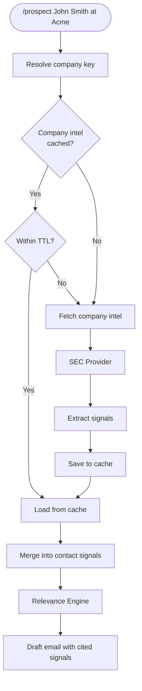

# Company Intelligence Layer

## Overview

The Company Intelligence Layer provides durable, company-level intelligence that is fetched once, cached to disk, and reused across all contacts at that company. This eliminates redundant research for multiple contacts at the same account and provides richer context from authoritative sources like SEC filings.

## Key Concepts

### Company Key Derivation

The canonical identifier for a company is the **Salesforce Primary Account ID**. This ensures consistency across the sales system.

**Priority Order:**
1. `primary_account_id` (Salesforce) - CANONICAL
2. `site_account_id` (Salesforce) - resolves to primary
3. `domain` - alias lookup
4. `zoominfo_company_id` - alias lookup
5. `sec_cik` - alias lookup
6. `normalized_name` - last resort

### Signal Classification

Signals are classified by source type, which determines whether they can be explicitly cited in outreach:

| Source Type | Citability | Usage |
|-------------|------------|-------|
| `public_url` | `cited` | Can make explicit company claims |
| `user_provided` | `cited` | Can make explicit claims |
| `vendor_data` | `uncited` | Guidance only - cannot cite |
| `inferred` | `uncited` | Guidance only - cannot cite |

**Example:**
- **Sayable (public_url):** "I noticed from your SEC filing that you operate 5 manufacturing facilities..."
- **Not Sayable (vendor_data):** Cannot say "I heard from ZoomInfo that you're expanding..."

### Caching TTLs

| Data Type | TTL |
|-----------|-----|
| SEC metadata | 30 days |
| SEC filings index | 14 days |
| SEC 10-K text | Refresh only when newer filing exists |
| ZoomInfo data (future) | 7 days |

## Storage Layout

All company intelligence is stored under:
```
$PROSPECTING_OUTPUT_ROOT/accounts/{primary_account_id}/
├── intel/
│   ├── index.json              # Master index with provider status + aliases
│   ├── signals_public.json     # public_url signals (cited)
│   ├── signals_vendor.json     # vendor_data signals (uncited)
│   ├── signals_user.json       # user_provided signals
│   ├── sources.json            # All source URLs with dates
│   └── sec/
│       ├── metadata.json       # CIK, ticker, SIC, filing counts
│       ├── filings_index.json  # All filings list
│       ├── 10k_latest.txt      # Latest 10-K text (250K char cap)
│       └── signals.json        # SEC-extracted signals
└── sites/
    └── {site_account_id}/      # Site-specific data (future)
```

## How /prospect Inherits Company Intel



## How the Orchestrator Uses Company Intel

The `ResearchOrchestrator` automatically fetches company intel before contact research:

```python
from company_intel import CompanyIntelService

# Initialize with company intel service
orchestrator = ResearchOrchestrator(
    company_intel_service=CompanyIntelService()
)

# Research a contact
results = orchestrator.research_prospect(
    name="John Smith",
    company="Acme Pharma",
    primary_account_id="001ABC123",  # Optional but recommended
    refresh_company_intel=False      # Set True to force refresh
)

# Company intel is available in results
company_intel = results.get('company_intel')
if company_intel:
    public_signals = company_intel.signals.get('public_url', [])
    for signal in public_signals:
        print(f"[CITED] {signal.claim}")
```

## Signal Flow in Relevance Engine

Company intel signals are merged FIRST (highest priority) in the relevance engine:

```python
def extract_signals(self, research_data, context):
    signals = []

    # 1. Company intel signals (highest priority)
    if 'company_intel' in research_data:
        intel = research_data['company_intel']
        # Add public_url signals (cited)
        # Add vendor_data signals (uncited, guidance only)

    # 2. Perplexity signals
    # 3. WebFetch signals
    # 4. ZoomInfo contact signals

    return signals
```

## Providers

### SEC Provider (Implemented)

Extracts signals from SEC EDGAR filings:

- **Manufacturing footprint:** Number and location of facilities
- **Restructuring:** Reorganization plans, workforce reductions
- **Quality/Compliance:** FDA warnings, GMP initiatives
- **Digital transformation:** ERP, automation initiatives
- **Supply chain:** Disruptions, single-source risks

**All SEC signals are:**
- `source_type: 'public_url'`
- `citability: 'cited'`
- `scope: 'company_level'`

### Future Providers (Stubs)

| Provider | Data Source | Source Type |
|----------|-------------|-------------|
| FDA | FDA warning letters, 483s | `public_url` |
| News | Press releases, news | `public_url` |
| Jobs | Job postings | `public_url` |
| ZoomInfo | Scoops, intent | `vendor_data` |

## API Reference

### CompanyIntelService

```python
class CompanyIntelService:
    def get_company_intel(
        company_name: str,
        primary_account_id: str = None,  # CANONICAL
        site_account_id: str = None,     # Resolves to primary
        domain: str = None,              # Alias lookup
        refresh: bool = False,           # Force refresh
        providers: List[str] = None      # Default: ['sec']
    ) -> CompanyIntelResult
```

### CompanyIntelResult

```python
{
    "company_name": "Acme Pharmaceuticals",
    "primary_account_id": "001ABC123456789",
    "aliases": {
        "site_account_ids": ["001DEF...", "001GHI..."],
        "domains": ["acmepharma.com"],
        "zoominfo_company_ids": ["123456789"],
        "sec_cik": "0001234567",
        "normalized_names": ["acme-pharmaceuticals"]
    },
    "last_refreshed": "2025-12-10T10:30:00Z",
    "sources": {
        "sec": {"status": "success", "last_run": "...", "expires_at": "..."}
    },
    "signals": {
        "public_url": [
            {
                "signal_id": "sec_10k_mfg_001",
                "claim": "Company operates 3 manufacturing facilities",
                "source_url": "https://www.sec.gov/...",
                "source_type": "public_url",
                "citability": "cited",
                "scope": "company_level",
                "provider": "sec",
                "filing_type": "10-K"
            }
        ],
        "vendor_data": [],
        "user_provided": []
    },
    "total_signals": {
        "public_url": 5,
        "vendor_data": 0,
        "user_provided": 0
    }
}
```

## Refresh Behavior

| Scenario | Behavior |
|----------|----------|
| First contact at company | Fetch all providers |
| Second contact (within TTL) | Load from cache |
| Data expired | Refresh expired providers only |
| `refresh=True` | Force refresh all |
| SEC API failure | Return cached data, mark as 'stale' |
| Company not found in SEC | Empty signals, don't block |

## Error Handling

| Error | Behavior |
|-------|----------|
| SEC API timeout | Return cached if available |
| Company not in SEC | Empty signals, continue |
| Cache write failure | Log, continue with in-memory |
| 10-K download failure | Return metadata only |
| Regex extraction failure | Empty signals, log error |

## Testing

Run company intel tests:
```bash
python -m pytest tests/test_company_intel/ -v
```

Test coverage includes:
- Cache operations (save/load/TTL)
- Signal extraction patterns
- Alias registration and lookup
- Provider refresh logic
