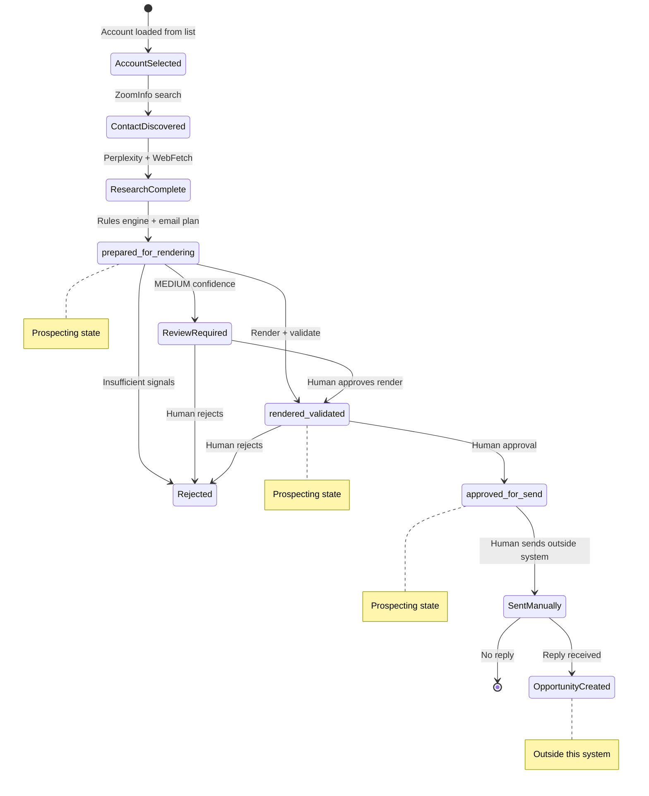

# Prospecting System: Agent Reference

*For Claude Agents, Automation, and Developers*

---

## System Contract

### Inputs

The system accepts:

| Input | Format | Required |
|-------|--------|----------|
| Account list | CSV or JSON | Yes |
| Top N parameter | Integer | No (default: 10) |
| Max drafts per account | Integer | No (default: 3) |
| Tier | A or B | No (default: A) |
| Execution mode | cli or headless | No (auto-detect) |

### Outputs

The system guarantees:

| Output | Location | Format |
|--------|----------|--------|
| Draft artifacts | `{output_root}/{Company}/drafts/` | JSON, MD |
| Run dashboard | `{output_root}/runs/` | JSON, MD |
| Context quality metadata | Per-draft | JSON |
| Render status | Per-draft (after render) | JSON |

### What the System Does NOT Do

The system explicitly does not:

- Send emails
- Update external systems (CRM, Salesforce)
- Create opportunities or deals
- Write to `01_Accounts/_Active/` during prospecting
- Make autonomous decisions about sending
- Bypass human review for final approval

---

## Canonical States

Prospecting artifacts progress through these states:

### `prepared_for_rendering`

- Research complete
- Email plan built with draft sentences
- Context quality metadata written
- Artifacts saved to drafts folder
- **Not yet final email text**

### `rendered_validated`

- Final email text generated
- Validation checks passed (or repaired)
- Render status file written
- **Ready for human review**

### `approved_for_send`

- Human reviewed and approved
- Marked as ready for manual sending
- **Still in prospecting territory**
- **Does NOT imply opportunity**

### State Invariants

```
prepared_for_rendering → rendered_validated → approved_for_send
```

- States are sequential; no skipping
- All states remain in `02_Prospecting/`
- No state implies the email was sent
- No state implies an opportunity exists

---

## State Transition Diagram



---

## Execution Modes

### CLI Mode (`cli`)

- No API keys required
- Deterministic template rendering
- Draft sentences assembled from rules
- No LLM generation
- Fastest execution
- Suitable for batch operations

### Headless Mode (`headless`)

- API keys optional
- LLM generation when available
- Falls back to deterministic if no API key
- Default mode for automation

### Mode Detection

```python
# Auto-detection order:
1. ANTHROPIC_API_KEY present → headless with LLM
2. ANTHROPIC_API_KEY absent → headless with deterministic fallback
3. --execution_mode cli → forced CLI mode
```

### Deterministic Fallback Behavior

When LLM is unavailable:

- Angle scoring uses rule-based selection
- Email body uses pre-written draft sentences
- Subject lines use template candidates
- Validation still runs
- Render status includes warning: `RENDERED_DETERMINISTIC_NO_LLM`

---

## Gates and Warnings

### Confidence Gates

| Confidence | Automation Allowed | Render Gate | Review Required |
|------------|-------------------|-------------|-----------------|
| HIGH | Yes | Pass | No |
| MEDIUM | No | Block (requires review) | Yes |
| LOW | No | Block (hard) | Yes |

### Warning Types

| Warning | Severity | Can Force | Description |
|---------|----------|-----------|-------------|
| `stale_signals` | Medium | Yes | Cited signals older than threshold |
| `ambiguous_persona` | Medium | Yes | Title matched multiple personas |
| `low_signal_count` | High | Yes | Fewer signals than tier requires |
| `no_company_signals` | High | Yes | No company-level intelligence |
| `regulatory_persona` | Critical | No | Regulatory contacts need extra care |

### `review_required` Behavior

When `review_required: true`:

- Automatic rendering is blocked
- Item appears in review queue with flag
- Human must explicitly approve to continue
- Can be forced with `--force` flag (except regulatory)

### Regulatory Persona Behavior

Contacts with regulatory personas have special handling:

- Cannot be auto-rendered regardless of confidence
- Cannot be forced past review gate
- Must always have human approval
- Flagged in review queue as `regulatory`

---

## Path Rules (Hard Constraints)

### Invariant 1: Prospecting Artifacts Stay in Prospecting

```
All generated artifacts MUST be written to:
  02_Prospecting/agent-prospecting/{Company}/drafts/

Agents MUST NOT write to:
  01_Accounts/_Active/
```

### Invariant 2: Approval Is Not Promotion

```
approved_for_send ≠ opportunity
approved_for_send ≠ moved to 01_Accounts
approved_for_send = ready for human to send manually
```

### Invariant 3: No Opportunity Until Reply

```
Opportunity exists IFF:
  - Email was sent (manually, outside system)
  - AND recipient replied OR meeting booked

Until then:
  - Account remains in prospecting
  - No MEDDPIC tracking
  - No pipeline stage
```

### Invariant 4: Agents Cannot Send

```
No agent action results in email transmission.
Sending is always:
  - Manual
  - Outside this system
  - By human user
```

---

## Artifact Contract

### Per-Contact Artifacts

| File | Purpose | Written At |
|------|---------|------------|
| `{date}_{contact}_email_context.json` | Full context for rendering | prepared_for_rendering |
| `{date}_{contact}_email.md` | Human-readable email plan | prepared_for_rendering |
| `{date}_{contact}_context_quality.json` | Quality metadata | prepared_for_rendering |
| `{date}_{contact}_render_status.json` | Render outcome | rendered_validated |

### Run-Level Artifacts

| File | Purpose | Written At |
|------|---------|------------|
| `{date}_outbound_run.json` | Machine-readable dashboard | End of run |
| `{date}_outbound_run.md` | Human-readable dashboard | End of run |

### Context Quality Schema

```json
{
  "generated_at": "ISO timestamp",
  "run_id": "8-char hex",
  "company": { "name": "string" },
  "contact": {
    "name": "string",
    "persona": "quality|ops|it|regulatory",
    "review_required": "boolean"
  },
  "mode": {
    "tier": "A|B",
    "confidence_mode": "HIGH|MEDIUM|LOW"
  },
  "signals": {
    "counts": {
      "total_cited": "integer",
      "company_cited": "integer"
    },
    "freshness": {
      "newest_cited_age_days": "integer"
    },
    "warnings": ["string"]
  }
}
```

---

## What Agents Must Never Assume

### Approved ≠ Sent

An `approved_for_send` status means a human reviewed and approved the email. It does not mean the email was transmitted. Sending happens outside this system.

### Approved ≠ Opportunity

Approval is a prospecting action. Opportunities only exist after engagement (reply, meeting). Do not create opportunity-related artifacts for approved items.

### Confidence ≠ Correctness

HIGH confidence means the research signals support personalization. It does not guarantee the email is factually correct or will resonate. Human review is still required.

### Presence of Files ≠ Pipeline Progress

Finding artifact files in a folder does not indicate where the prospect is in the pipeline. Always read the `render_status.json` or dashboard to determine actual state.

### Rendered ≠ Ready to Send

A rendered email has passed validation checks. It still requires human approval before it is ready to send.

---

## Agent Behavioral Rules

### When Processing Accounts

1. Write all artifacts to `02_Prospecting/agent-prospecting/`
2. Never write to `01_Accounts/`
3. Always generate context quality metadata
4. Respect confidence gates
5. Flag review_required items in output

### When Rendering

1. Check confidence level before rendering
2. Block MEDIUM/LOW unless human approved
3. Never bypass regulatory personas
4. Record deterministic fallback if no LLM
5. Write render_status.json with outcome

### When Asked to Promote

1. Promotion means marking approved, not moving files
2. Do not write to `01_Accounts/_Active/`
3. Update status in prospecting artifacts only
4. Log the approval action

### When Asked About Opportunities

1. Opportunities are outside this system's scope
2. Do not create opportunity artifacts
3. Do not track MEDDPIC for prospects
4. Direct user to appropriate system for post-reply work

---

## Error Handling

### Recoverable Errors

| Error | Recovery |
|-------|----------|
| ZoomInfo unavailable | Skip contact discovery, log warning |
| Perplexity unavailable | Use cached data or skip |
| Insufficient signals | Reject with reason, do not render |
| Validation failure | Attempt repair (max 2), then fail |

### Non-Recoverable Errors

| Error | Behavior |
|-------|----------|
| No company name | Skip account entirely |
| Missing required config | Abort run |
| Write permission denied | Abort run |

---

## Summary

This system is a prospecting drafting tool. It generates emails, not opportunities. All artifacts remain in `02_Prospecting/` until a human sends the email and receives a reply. Agents must never assume approval equals sending, or that file presence indicates pipeline state. When in doubt, read the status files and respect the gates.
