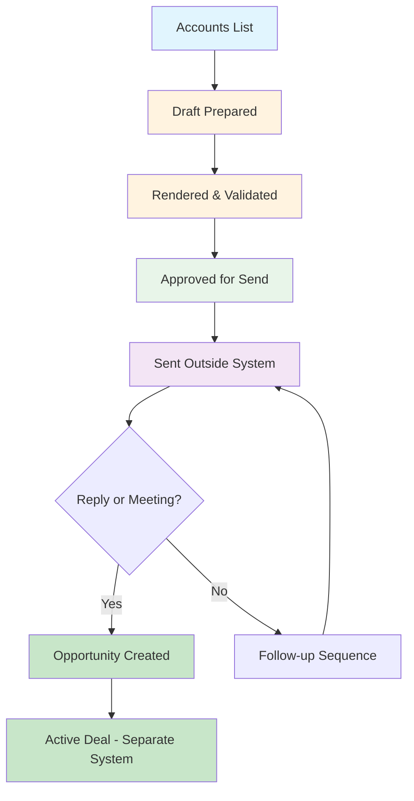

# Prospecting System Overview

*For Sales Users*

---

## What This System Is

This system helps you generate personalized outbound emails at scale. You give it a list of accounts, and it finds the right people, researches them, drafts emails tailored to their role and company situation, and queues them for your review. You decide what gets sent. The system does not send emails, does not update your CRM, and does not create opportunities. It is a drafting and review tool for pre-opportunity outreach.

---

## Key Concepts

### Account vs Opportunity

- **Account**: A company you want to reach. No relationship exists yet.
- **Opportunity**: A real sales conversation with a qualified prospect. Only exists after engagement (reply, meeting, or expressed interest).

These are not the same. This system works with accounts. Opportunities come later.

### Prospecting vs Active Deals

- **Prospecting**: Cold outreach to people who have not responded. Pre-opportunity work.
- **Active Deals**: Conversations in progress with qualified prospects. Post-opportunity work.

This system handles prospecting only. Active deals live in a different place and follow different processes.

### Draft vs Rendered vs Approved

| Stage | What It Means |
|-------|---------------|
| **Draft Prepared** | Research complete, email skeleton built, not yet finalized |
| **Rendered** | Final email text generated and validated against quality rules |
| **Approved for Send** | You reviewed it and marked it ready to send |

Approved does not mean sent. You still send manually.

### Confidence Levels

The system assigns a confidence level to each draft based on research quality:

| Level | Meaning |
|-------|---------|
| **HIGH** | Strong research signals, safe to render automatically |
| **MEDIUM** | Adequate signals but requires human review before rendering |
| **LOW** | Insufficient signals, not recommended for outreach |

Higher confidence means the email is more likely to be relevant and personalized correctly.

### Warnings

Warnings flag potential issues that require attention:

- **Stale signals**: Research data is old
- **Ambiguous persona**: Title could match multiple roles
- **Missing company intel**: Limited information about the company
- **Regulatory persona**: Extra caution required for regulatory contacts

Warnings do not block progress, but they tell you where to look more carefully.

---

## The Prospecting Lifecycle

### 1. Accounts Are Selected

You provide a list of accounts (CSV or JSON). The system selects the top accounts by priority score.

### 2. People Are Identified

For each account, the system searches for relevant contacts by role (Quality, Operations, IT). It finds names, titles, and basic information.

### 3. Drafts Are Prepared

The system researches each person and their company, identifies relevant signals (news, initiatives, challenges), and builds a draft email skeleton with:
- A hook based on real company news
- A pain point relevant to their role
- A low-friction call to action

### 4. Drafts Are Rendered

The draft skeleton becomes final email text. The system validates against rules:
- Word count limits
- No product pitching
- Must end with a question
- No banned phrases

If validation fails, the system attempts repairs.

### 5. Drafts Are Approved for Sending

You review each rendered email. You can:
- Approve it for sending
- Skip it
- Request changes

Approval means you are satisfied with the email. It does not mean the email has been sent.

### 6. Emails Are Sent Manually

You copy the approved email and send it through your normal email tool. The system does not send emails.

### 7. Only After a Reply Does an Opportunity Exist

When someone responds or books a meeting, you have an opportunity. At that point, the account moves to your active deals folder and a different process begins.

---

## Lifecycle Diagram

---

## Folder Structure

### Where Things Live

| Folder | Purpose |
|--------|---------|
| `02_Prospecting/` | All outbound prospecting work |
| `02_Prospecting/agent-prospecting/` | System-generated drafts, research, run logs |
| `02_Prospecting/agent-prospecting/runs/` | Daily run dashboards |
| `02_Prospecting/agent-prospecting/{Company}/drafts/` | Draft artifacts for each company |
| `01_Accounts/_Active/` | Active opportunities only |

### The Rule

> **If there is no reply, nothing belongs in `01_Accounts`.**

Prospecting artifacts stay in `02_Prospecting` until an opportunity exists. The `01_Accounts/_Active` folder is reserved for real conversations with qualified prospects.

---

## What This System Will NOT Do

| Action | Status |
|--------|--------|
| Send emails automatically | Never |
| Update Salesforce or CRM | Never |
| Create opportunities | Never |
| Track MEDDPIC before a reply | Never |
| Replace your judgment | Never |

This system prepares emails. You decide what happens next.

---

## Quick Reference

### Daily Workflow

1. Run the orchestrator on your account list
2. Review the queue for warnings and confidence levels
3. Render eligible drafts
4. Review and approve each email
5. Send manually
6. Log replies and create opportunities separately

### Commands You Will Use

| Command | Purpose |
|---------|---------|
| `outbound_run.py` | Process accounts and prepare drafts |
| `review_queue.py` | See what needs attention |
| `render_run.py` | Render prepared drafts |
| `promote_prospecting_artifacts.py` | Mark approved items (not send) |

### Questions to Ask Before Approving

- Does the hook reference something real and recent?
- Is the pain point relevant to this person's role?
- Would I be comfortable receiving this email?
- Is the call to action low-friction?

---

## Summary

This is a drafting system, not a sending system. It helps you create personalized outreach at scale while keeping you in control of every email that goes out. Nothing is sent without your explicit action. No opportunity exists until someone responds.
